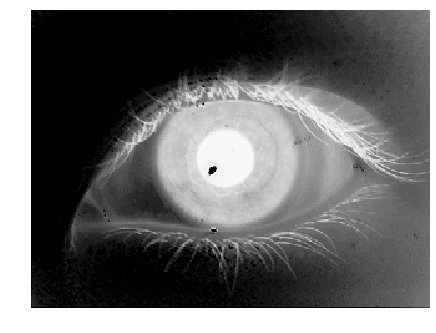
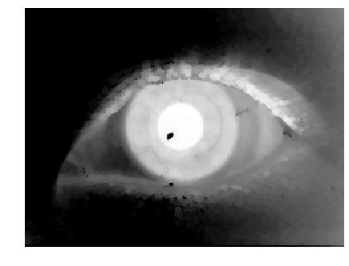
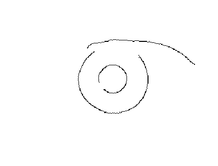
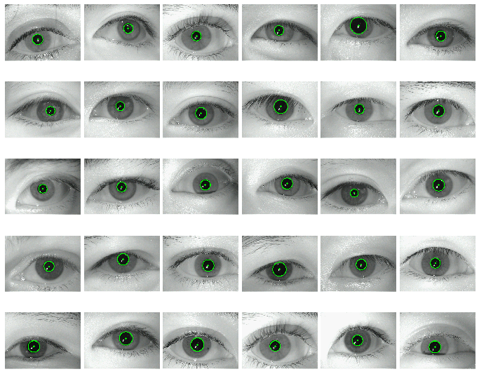

<h1>Iris recognition</h1>

Biometric identification based on human iris pattern comparison

Iris recognition as one of the approaches of physiological biometrics has been widely used in security and authentication systems. 
We are considering several iris recognition approaches: classical **computer vision** approaches based of Daugman’s algorithm and **deep learning** methodologies.
There are two stages in iris recognition: iris **segmentation** (detecting iris on image) and iris patterns **comparison**.

|Segmentation|
|---|
|Image preprocessing|
|Inner circle detection|
|Outer circle detection|
|CNN for iris segmentation|

|Comparison|
|--|
|Transform polar iris coordinates to rectangular|
|Gabor filter|
|Generate iris code|
|Hemming distance for iris code|
|Color distribution histograms comparison|
|Deep learning based methods|

### Datasets

[**MMU**](http://www.cs.princeton.edu/~andyz/downloads/MMUIrisDatabase.zip)
[**MMU2**](http://www.cs.princeton.edu/~andyz/downloads/MMU2IrisDatabase.zip)

 <table border="0" align="center">
 <tr>
      <th>Original image</th>
      <th>Inverted grayscale</th>
  </tr>
 <tr>
      <th></th>
      <th></th>
  </tr>
  <tr>
      <th>Black hat filter</th>
      <th>Median blurr</th>
  </tr>
  <tr>
      <th></th>
      <th></th>
  </tr>
  <tr>
      <th>Canny edge detector</th>
      <th>Hough circle transform</th>
  </tr>
  <tr>
      <th></th>
      <th></th>
  </tr>
</table>

<h2>Pupil detection examples<h2>

